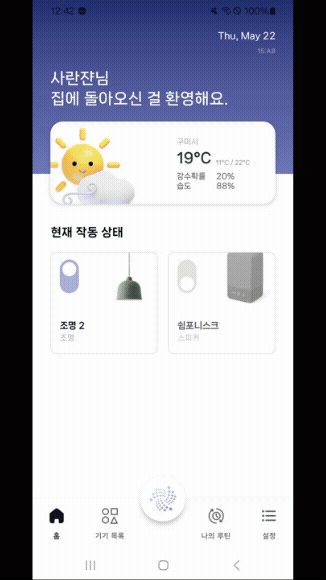

# 💗 **싸피 12기 2학기 자율 프로젝트**
## RUMOS
- 팀명 : **호구미와트**
- 팀원 : **장홍준, 이상혁, 서정후, 서미지, 이사랑, 이승지**

 

**개발 기간** : `2025/04/14(월) ~ 2025/05/22(목)`

## 목차
1. [팀원 소개](#팀원-소개)
2. [기술 스택](#기술-스택)
3. [서비스 소개](#서비스-소개)
4. [산출물](#산출물)
5. [주요 기능 상세설명](#주요-기능-상세설명)
6. [제스처 인식 방법](#제스처-인식-방법)
7. [주요 기능 외 화면](#주요-기능-외-화면)
6. [맡은 역할](#맡은-역할)

 

## 📌팀원 소개
### D103 - 호구미와트

| 이름    | 역할  |  파트 |
| ------ | ------ |  ---|
| **장홍준**  | 팀장 |  Android, UWB |   
| **이상혁** | 팀원 |  Android, WearOS |      
| **서정후** |  팀원 |  Android |     
| **서미지** | 팀원 |  백엔드, 인프라, 제스처 |  
| **이사랑** | 팀원 | 백엔드, 제스처  |  
 | **이승지** | 팀원 | 백엔드, 제스처 |  

 

## 📌기술 스택

### Android

- **MVI, Mutli-Module, DI(Hilt)**

### Back-End

- **Lombok, MSA**

### DB

### Monitoring

- Node Exproter, cAdvisor, Promtail, Loki

### INFRA

### GESTURE

### 협업 및 관리 도구

&nbsp;

 

## 📌서비스 소개

### 1. 기획의도

> “스마트홈, 왜 이렇게 복잡할까?”

최근 스마트홈 기기의 보급이 늘어나며, 누구나 손쉽게 가전제품을 원격으로 제어할 수 있게 되었습니다. 하지만 정작 여러 기기를 동시에 다루거나 빠르게 원하는 동작을 실행하려면 앱을 켜고, 메뉴를 찾아 들어가야 하는 복잡한 조작 과정이 필요합니다.

RUMOS는 이러한 불편을 해결하기 위해 시작되었습니다.
우리는 사용자의 직관적인 움직임과 손목 제스처, UWB 방향 인식을 통해 말 없이도 기기와 대화하는 방식의 스마트홈을 제안합니다.

이제 손가락 하나 까딱하지 않아도,
“기기를 향해 스마트폰을 들이대거나 손목을 흔들기만 해도”
집안의 조명, 스피커, 공기청정기가 마법처럼 반응합니다.

 

### 2. 주요 기능(서비스)

#### 1. 📡 UWB를 이용한 기기 방향 인식 및 제어

- UWB(Ultra-Wideband) 기술을 통해, 스마트폰이 가리키는 방향에 있는 스마트 기기를 자동으로 탐색합니다.
- 동일한 기기가 여러 대 있을 경우에도, 정확히 원하는 기기만 선택하여 제어할 수 있습니다.
- 리스트를 스크롤하거나 이름을 기억할 필요 없이, 직관적인 공간 중심 제어를 실현했습니다.

> 📌 예: 공기청정기 두 대 중 오른쪽에 있는 기기만 끄고 싶을 때, 스마트폰을 오른쪽으로 향한 뒤 바로 제어 가능

#### 2. ⌚ Wear OS 기반 워치로 기기 제어

- **스마트워치 단독 제어**: 워치에서 기기 전원, 밝기, 풍량 등 스마트싱스 기기의 주요 기능을 직접 조작할 수 있습니다.
- **루틴 실행**: 자주 사용하는 기기 조합을 하나의 루틴으로 저장하고, 워치에서 즉시 실행 가능합니다.

#### 3. 🤘 손목 제스처를 통한 루틴 실행

- 사용자가 정의한 제스처 하나로 조명+스피커+스위치 제어가 동시에 실행됩니다.
- 예를 들어, 손목을 좌우로 두 번 흔들면 **야간 모드(조명 OFF, 스피커 음소거)**가 실행되는 식입니다.
- 제스처가 인식되면 워치 진동으로 피드백을 제공하여, 즉각적인 반응 확인이 가능합니다.

> 🪄 집안 어디서든, 앱을 열지 않고 ‘움직임’만으로 원하는 스마트홈 설정을 실행하세요.

 

## 📌산출물 
- [API 명세서 및 Swagger](docs/API.md)
- [ERD 다이어그램](docs/Lumos-ERD.png)
- [시스템 아키텍처](docs/architecture.png)
- [시연 영상](https://www.youtube.com/watch?v=rohFAwGDQHM)
- [중간 발표 PPT]()
- [최종 발표 PPT]()

 

## 📌주요 기능 상세설명

### 1. UWB를 통한 스마트 싱스 기기 제어

- 스마트폰을 특정 방향으로 가리키는 것만으로 해당 기기 탐색 및 제어 가능
- 동일 기종 기기가 여러 대 있을 경우에도 정확한 대상 지정 가능
- 리스트 탐색 없이 직관적 공간 제어 구현

### 2. 워치를 활용한 스마트 싱스 기기 제어 

- 조명 제어

- 공기 청정기 제어

- 스피커 제어

### 3. 자체 제스처를 통한 스마트홈 루틴 제어

- 제공하는 제스처를 통해 사전 설정된 루틴 즉시 실행
- 조명, 스피커, 스위치 등 다중 제어 조건을 하나의 제스처로 처리
- 제스처 인식 성공 시 진동 피드백으로 즉각적인 사용자 응답

 
 

## 📌 제스처 인식 방법
우리는 손목의 IMU 센서 데이터를 활용하여, 사용자가 설정한 고유 제스처를 정확하게 인식합니다.

### 📊 처리 및 분석 과정
**1. 데이터 수집**
- 워치에서 **가속도/자이로 데이터**를 실시간 수집
- WebSocket을 통해 FastAPI 서버에 전송

**2. 특징 추출**

- **Haar 변환**, 방향 전환 횟수, 평균/표준편차 등 시계열 기반 통계 특징을 분석

**3. AI 추론**
- **Metric Learning 기반 알고리즘**으로 학습한 제스처들과의 거리 계산을 통해 실시간 분류
- 사용자가 직접 정의한 제스처도 정확히 식별 가능

**4. 응답 및 피드백**
- 인식 결과를 서버에서 스마트폰/워치로 반환
- 워치 진동으로 사용자에게 즉시 피드백 제공

### 🔍 제스처 AI 특징
- 사용자의 손목 습관에 맞는 맞춤형 인식 가능
- 기존의 딥러닝 기반 제스처 인식과 달리, 빠르고 가벼운 모델로 워치와의 실시간 연동 구현
- 제스처가 명확하지 않아도, 다중 시계열 특성을 반영해 높은 정확도 유지

 

## 📌 주요 기능 외 화면
### 1. 로그인 및 회원 가입, 온보딩

- 신규 사용자를 위한 단계별 온보딩 화면 제공
  → 제스처 설정, 루틴 예시, 기기 연동 방법 등 안내
- 앱 접근 권한 요청(블루투스, 위치 등) 및 사용 목적 설명 포함

### 2. 스마트싱스(SmartThings) 연동을 통한 통합 제어
- 삼성 SmartThings 계정 연동을 통해 보유 중인 IoT 기기 자동 인식
- 스마트폰과 워치 모두에서 동일한 기기 목록 및 기기 상태를 실시간으로 확인 및 제어 가능
- 앱 하나로 다양한 디바이스를 통합 관리 가능

### 3. 기기 상태 확인 및 기기 제어 
- 갤럭시 스마트폰과 워치에서 SmartThings 기기의 기본 기능(전원, 밝기 등) 제어 가능
- 빠르고 직관적인 컨트롤 제공
- SmartThings 연동 기기의 전원 상태, 밝기, 팬 속도 등 실시간 확인 가능
- 제공 하는 기기 목록: 스마트 조명, 공기 청정기, 스피커, 미니빅 스위치

1) **워치 로그인**

2) **워치 기기목록 리스트**

3) **휴대폰 제어**

### 4. 제스처 테스트 화면

1. 폰 앱 ▶︎ “제스처 테스트” 버튼 탭
2. 워치 화면 ▶︎ 제스처 인식 가이드 확인
3. 제스처 수행 ▶︎ 폰 화면에서 결과 확인

- 휴대폰 화면

- 워치 테스트 화면

### 5. 루틴 생성/수정/삭제
- 제스처로 실행할 수 있는 루틴의 생성, 수정, 삭제 기능 제공
- 루틴을 통해 여러 IoT 기기를 한 번에 제어할 수 있는 통합 제어 흐름 지원

| 루틴 생성 |  루틴 수정 | 루틴 삭제 |
|---|---|---|
|  |  |  |

 

## 📌맡은 역할

- 장홍준
  - 팀장, UWB, 안드로이드
  - UWB
  - 안드로이드
    - 네비게이션 구현
    - 홈 화면 및 날씨

- 서정후
  - 안드로이드, UI/UX 디자인
  - 안드로이드
    - 루틴 화면
    - SmartThings 로그인
    - 기기 목록 

- 이상혁
  - 안드로이드
    - 제스처 화면 및 워치 동기화
    - 워치/앱 기기제어 화면
    - 워치 루틴 실행 

- 서미지
  - 인프라, 백엔드
  - 인프라
    - 무중단 배포
  - 백엔드
    - MSA
    - 삼성 smartThings
    - 회원 관리
    - 루틴 제어
    - 워치 센서 데이터

- 이사랑
    - 백엔드, 제스처 AI
    - 백엔드
      - 기기제어 API(공기청정기, 스위치, 스피커)
      - 기기관리 API 
    - 제스처 AI
      - 워치 모션 데이터를 활용한 제스처 인식

- 이승지
    - 백엔드, 제스처 AI, 안드로이드
    - 백엔드
      - 루틴 삭제/조회/수정
      - 조명 제어

    - 제스처 AI
       - 워치 모션 데이터를 활용한 제스처 인식
    - 안드로이드
        - 기기제어 UI
        - 설정 화면
        - 워치 루틴 실행

 
